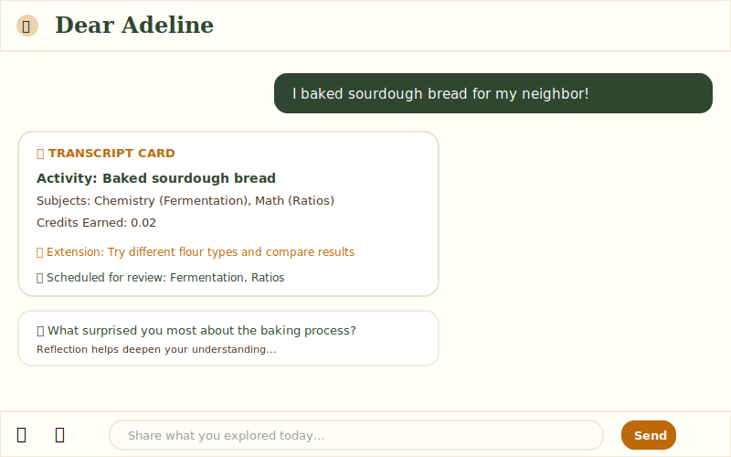
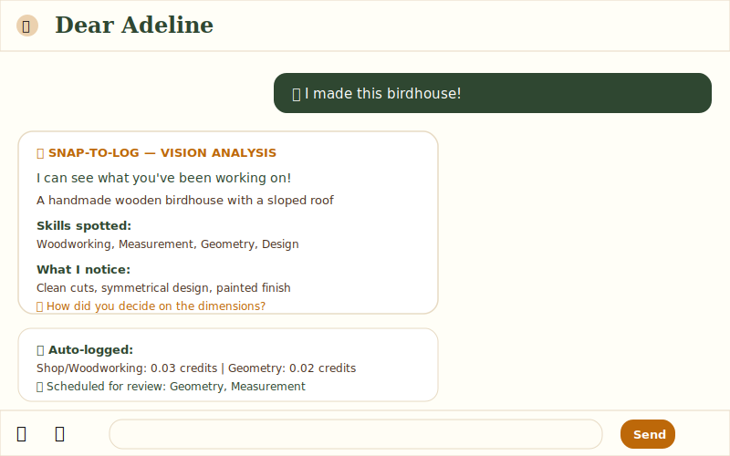
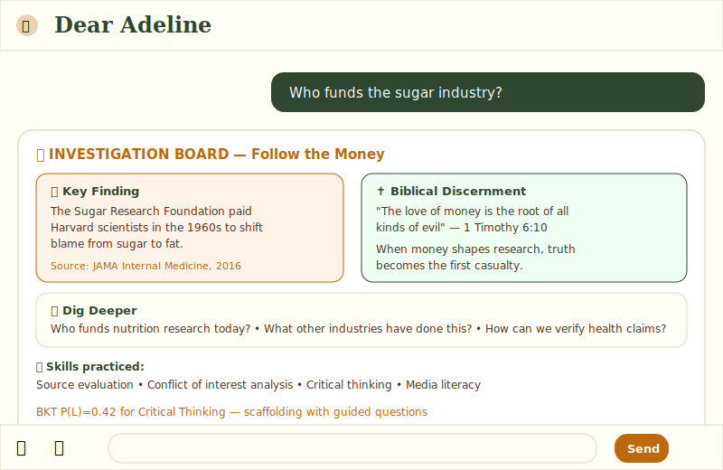

# Dear Adeline

**Interest-led AI learning companion for Christian homeschool families.**

[](https://vercel.com/new/clone?repository-url=https%3A%2F%2Fgithub.com%2Famberdawn84ac-bot%2Fcascade-adeline&env=OPENAI_API_KEY,DATABASE_URL,NEXT_PUBLIC_SUPABASE_URL,NEXT_PUBLIC_SUPABASE_ANON_KEY,UPSTASH_REDIS_REST_URL,UPSTASH_REDIS_REST_TOKEN,STRIPE_SECRET_KEY,STRIPE_WEBHOOK_SECRET&envDescription=API%20keys%20needed%20for%20Dear%20Adeline&envLink=https%3A%2F%2Fgithub.com%2Famberdawn84ac-bot%2Fcascade-adeline%23environment-variables&project-name=dear-adeline)

Adeline is a wise, discerning mentor who turns everyday life into meaningful education. She logs real-world activities for credits, suggests projects in the student's Zone of Proximal Development, prompts metacognitive reflection, teaches discernment ("follow the money"), and weaves systemic justice into every learning activity — all with a beautiful sketchnote aesthetic and no busywork.

Built with love for homeschool families who learn by doing and serve their communities.

## Features

### Learning Engine

- **LifeCreditLogger**: "I baked bread" → auto-credits + reflection prompt
- **ZPD Engine**: Suggests projects exactly where the child is ready to grow (Bayesian Knowledge Tracing)
- **Discernment Engine**: Biblical "follow the money" investigations with primary sources
- **Snap-to-Log**: Photo upload → GPT-4o vision analysis → credits
- **Spaced Repetition System**: SuperMemo-2 algorithm with review scheduling
- **Metacognitive Reflection**: Schön's reflective practice with 5 dimensions
- **Generative UI**: Transcript cards, investigation boards, project impact cards
- **Lesson System**: Streaming lessons with 12 block types (text, scripture, primary source, investigation, quiz, hands-on, photo, video, flashcard, infographic, game, worksheet)
- **Semantic Cache**: Embedding-based caching with 0.92 similarity threshold

### Dashboard Rooms (7 Learning Spaces)

- **Science**: Laboratory experiments, field work, encyclopedia, co-op missions
- **Math**: Business analysis, data analysis, geometry, trade partnerships
- **History**: Timelines with primary sources, collaborative timelines
- **Reading Nook**: Book curation, Socratic discussion, book clubs
- **Expeditions**: Homesteading field studies, stewardship missions, co-op field journals
- **Future Prep**: CLEP guides, career ethics analysis, study groups
- **ELA**: Story writing with peer review circles
- **Arcade**: Spelling bee, typing racer, code quest, multiplayer challenges
- **Domestic Arts**: Practical life skills integration
- **Bible Study**: Scripture connections with Hebrew/Greek word studies
- **Journal**: Reflection and metacognition tracking

### Systemic Justice Integration

- **No Hypotheticals**: Real FOIA requests, real advocacy letters, real deliveries to neighbors
- **Systemic Focus**: Expose regulatory capture, corporate harm, clemency campaigns
- **Integrated Learning**: Justice work woven into every room (not separate "civics" class)
- **Specific Actions**: Draft FOIA requests to County Water Department, write representatives, deliver harvests to elderly neighbors
- **Policy Analysis**: Detect profit-from-harm patterns in business math, identify inequality in data

### Revenue & Growth (GTM)

- **4-Tier Pricing**: Free → $2.99 Student → $9.99 Parent → $29.99 Teacher
- **Stripe Subscriptions**: Checkout, webhooks, customer portal
- **Message Limits**: 10/mo free, unlimited paid
- **Referral System**: $10/$10 give/get with cookie-based attribution
- **SEO Landing Page**: Hero, testimonials, FAQ, conversion-optimized
- **PostHog Analytics**: 20+ tracked events across the funnel

### Safety & Compliance

- **PII Masking**: 8 PII types redacted before LLM calls (email, phone, SSN, credit card, IP, address, name, DOB)
- **Content Moderation**: Regex patterns + OpenAI Moderation API
- **COPPA Consent**: Parent-gated data controls with consent tracking
- **Rate Limiting**: Redis-based sliding window (30/min per user)
- **Input Validation**: Zod schema validation on all API routes

## In Action


*"I baked sourdough bread" → TranscriptCard + reflection prompt + spaced repetition scheduling*


*Photo upload → GPT-4o vision analysis → auto-logged credits + review scheduling*


*"Who funds the sugar industry?" → Investigation board with biblical discernment + BKT-calibrated scaffolding*

## Tech Stack

| Layer          | Technology                          |
|----------------|-------------------------------------|
| Framework      | Next.js 16 (App Router)             |
| Language       | TypeScript                          |
| Database       | Supabase Postgres + pgvector        |
| ORM            | Prisma 7                            |
| Cache          | Upstash Redis (HTTP)                |
| AI SDK         | Vercel AI SDK v6 + LangGraph        |
| Default LLM    | GPT-4o (OpenAI)                     |
| Investigation LLM | Claude 3 Sonnet (Anthropic)      |
| Embeddings     | text-embedding-3-small (1536 dim)   |
| Auth           | Supabase Auth                       |
| Payments       | Stripe (subscriptions + webhooks)   |
| Analytics      | PostHog                             |
| Deployment     | Vercel (serverless)                 |
| UI             | React 19, Tailwind CSS, Radix UI    |
| Testing        | Vitest (unit), Playwright (E2E)     |

See [ROADMAP.md](ROADMAP.md) for full architecture and implementation details.

## Testing

### Unit Tests

```bash
npm run test              # Run once
npm run test:watch        # Watch mode
npm run test -- --coverage # With coverage
```

### E2E Tests

```bash
npm run test:e2e          # Headless (CI mode)
npm run test:e2e:ui       # Interactive UI
npm run test:e2e:headed   # See browser
```

### All Tests

```bash
npm run test:all          # Unit + E2E
```

### Performance Benchmarks

```bash
npm run test:e2e -- e2e/specs/performance.spec.ts
npm run bundlewatch       # Check bundle sizes
```

## CI/CD

All tests run automatically on pull requests:

- ✅ Unit tests with coverage
- ✅ E2E tests (3 browsers: Chrome, Firefox, Safari)
- ✅ TypeScript type checking
- ✅ ESLint
- ✅ Lighthouse audits (Performance >90, A11y >95)
- ✅ Prisma schema validation
- ✅ Bundle size monitoring

## Quick Start

```bash
# 1. Clone
git clone https://github.com/amberdawn84ac-bot/cascade-adeline.git
cd cascade-adeline

# 2. Setup (creates .env + DB + seeds)
npm install
npm run setup

# 3. Run
npm run dev
```

## Environment Variables

See [`.env.example`](.env.example) for the full list with comments. Summary:

| Variable | Required | Description |
|----------|----------|-------------|
| `OPENAI_API_KEY` | ✅ | OpenAI API key (LLM + embeddings + vision) |
| `DATABASE_URL` | ✅ | Supabase PostgreSQL connection string (port 6543 with pgbouncer) |
| `DIRECT_DATABASE_URL` | ✅ | Supabase direct connection (port 5432 for migrations) |
| `NEXT_PUBLIC_SUPABASE_URL` | ✅ | Supabase project URL |
| `NEXT_PUBLIC_SUPABASE_ANON_KEY` | ✅ | Supabase anonymous key |
| `SUPABASE_SERVICE_ROLE_KEY` | ✅ | Supabase service role key |
| `UPSTASH_REDIS_REST_URL` | ✅ | Upstash Redis URL |
| `UPSTASH_REDIS_REST_TOKEN` | ✅ | Upstash Redis token |
| `STRIPE_SECRET_KEY` | ✅ | Stripe secret key |
| `NEXT_PUBLIC_STRIPE_PUBLISHABLE_KEY` | ✅ | Stripe publishable key |
| `STRIPE_WEBHOOK_SECRET` | ✅ | Stripe webhook signing secret |
| `NEXT_PUBLIC_APP_URL` | ✅ | Your app URL (e.g. `https://dear-adeline.vercel.app`) |
| `SESSION_SECRET` | ✅ | Generate with crypto (48-char hex) |
| `CRON_SECRET` | ✅ | Generate with crypto (48-char hex) |
| `ANTHROPIC_API_KEY` | — | Claude 3 for investigations |
| `GOOGLE_API_KEY` | — | Gemini alternative provider |
| `GOOGLE_GENERATIVE_AI_API_KEY` | — | Gemini Flash (alternative default) |
| `TAVILY_API_KEY` | — | Web search for discernment |
| `NEXT_PUBLIC_POSTHOG_KEY` | — | PostHog analytics |
| `RESEND_API_KEY` | — | Transactional emails |
| `STRIPE_PRICE_*` | — | Stripe price IDs (6 total) |

## Deploy to Vercel

### One-Click Deploy

Click the button at the top of this README, or:

[](https://vercel.com/new/clone?repository-url=https%3A%2F%2Fgithub.com%2Famberdawn84ac-bot%2Fcascade-adeline&env=OPENAI_API_KEY,DATABASE_URL,NEXT_PUBLIC_SUPABASE_URL,NEXT_PUBLIC_SUPABASE_ANON_KEY,UPSTASH_REDIS_REST_URL,UPSTASH_REDIS_REST_TOKEN,STRIPE_SECRET_KEY,STRIPE_WEBHOOK_SECRET&envDescription=API%20keys%20needed%20for%20Dear%20Adeline&envLink=https%3A%2F%2Fgithub.com%2Famberdawn84ac-bot%2Fcascade-adeline%23environment-variables&project-name=dear-adeline)

### Manual Deploy

```bash
# Install Vercel CLI
npm i -g vercel

# Deploy
vercel --prod
```

### Post-Deploy Checklist

1. **Set all env vars** in Vercel → Project → Settings → Environment Variables
2. **Run DB migration**: `npx prisma db push` (or use Vercel's build command)
3. **Create Stripe products** in the Dashboard:
   - Student: $2.99/mo, $32.29/yr (10% discount)
   - Parent: $9.99/mo, $107.89/yr (10% discount)
   - Teacher: $29.99/mo, $323.89/yr (10% discount)
   - Extra Student: $2.99/mo
4. **Add Stripe webhook** pointing to `https://your-domain.vercel.app/api/stripe/webhook`
   - Events: `checkout.session.completed`, `customer.subscription.updated`, `customer.subscription.deleted`, `invoice.payment_succeeded`, `invoice.payment_failed`
5. **Set `NEXT_PUBLIC_APP_URL`** to your production URL
6. **Configure PostHog** (optional) — add project key to env vars

## Architecture

### Core Pillars

**Pillar 1: Absolute Adaptation** ✅ Complete
- All generation routes use `buildStudentContextPrompt(userId)` to adapt to student's exact ZPD
- Bayesian Knowledge Tracing (BKT) for mastery tracking
- Personalized project suggestions based on learning gaps

**Pillar 2: Applied Reality** ✅ Strong
- Primary sources required in History and Science
- Household materials only in Laboratory
- Real homestead tasks in Field Work
- No kits, no purchases, no hypotheticals

**Pillar 3: Collaboration Hooks** ⚠️ Partial
- Science co-op missions implemented
- Math trade partnerships planned
- History collaborative timelines planned
- Reading Nook book clubs planned

### Data Flow

```
User message → Content Moderation (block if unsafe)
            → PII Masking (redact personal info)
            → Semantic Cache check (return cached if similar)
            → Router (classify intent)
            → Agent workflow (traced + timed):
                LIFE_LOG  → lifeCreditLogger → schedule reviews → reflectionCoach
                IMAGE_LOG → visionAnalyzer → lifeCreditLogger → reflectionCoach
                BRAINSTORM → projectBrainstormer (with ZPD context)
                INVESTIGATE → discernmentEngine
                REFLECT → reflectionCoach (score + follow-up)
                OPPORTUNITY → opportunityScout
                LESSON → lessonOrchestrator (streaming blocks)
                CHAT → streamText (general conversation)
            → genUIPlanner → gapDetector
            → Cache response → Flush traces → Return
```

## Documentation

- [ROADMAP.md](ROADMAP.md) - Strategic roadmap and implementation phases
- [QUICK-START.md](QUICK-START.md) - Get running in under 30 minutes
- [DEPLOYMENT_GUIDE.md](DEPLOYMENT_GUIDE.md) - Production deployment instructions
- [ADELINE-CONTEXT.md](ADELINE-CONTEXT.md) - Project context and debugging notes
- [ARCHITECTURAL_AUDIT_COMPLETE.md](ARCHITECTURAL_AUDIT_COMPLETE.md) - Architecture audit report
- [LESSON_SYSTEM_INTEGRATION.md](LESSON_SYSTEM_INTEGRATION.md) - Lesson system details
- [SYSTEMIC_JUSTICE_INTEGRATION.md](SYSTEMIC_JUSTICE_INTEGRATION.md) - Justice integration details
- [PRODUCTION_READINESS_SUMMARY.md](PRODUCTION_READINESS_SUMMARY.md) - Production readiness status
- [TESTING_GUIDE.md](TESTING_GUIDE.md) - Testing instructions

## Project Status

**Production Readiness**: Phases 1-5 Complete (25 critical issues resolved)

- ✅ Security & Critical Bugs (9 issues)
- ✅ Reliability & Data Integrity (6 issues)
- ✅ Error Tracking & Monitoring (4 issues)
- ✅ Performance Optimization (3 issues)
- ✅ DevOps & Testing Infrastructure (3 issues)

**Remaining Work**: Phase 6 - Documentation & Maintenance (9 issues)

## License

See [LICENSE](LICENSE) file for details.
